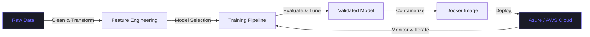

<p align="center">
  
</p>

<p align="center">
  <strong>Profile sync:</strong> <!--AUTO_UPDATE--> 2026-05-02
</p>

<p align="center">
  <em>Transforming raw data into production-ready intelligence systems</em>
</p>

<p align="center">
  
  &nbsp;
  <a href="https://www.linkedin.com/in/zain-ul-abideen3">
    
  </a>
  &nbsp;
  <a href="https://github.com/zain-ul-abideen-5036">
    
  </a>
</p>

---

### Who Am I


In a world driven by data, I've always been fascinated by how machines can learn, predict, and solve problems. From experimenting with Python scripts to building deep learning models, every project feels like a small adventure in turning ideas into intelligent systems.

I enjoy diving into complex datasets, uncovering patterns, and designing solutions that are both elegant and impactful. My curiosity doesn't stop at algorithms. I love seeing my models come to life in the cloud, handling real-world data, and delivering results at scale. Every line of code, every trained model, is a step toward transforming raw data into meaningful insights.

---

### Current Orbit

Right now, I'm orbiting the AI/ML universe, focused on building and deploying machine learning pipelines that solve real problems. Azure, Docker, and cloud deployment tools are my instruments as I turn experimental models into production-ready applications. I'm constantly exploring neural networks, predictive analytics, and AI-driven solutions, blending creativity with technical rigor to craft tools that make data work smarter.

---

## Roles & Recognition

<table align="center">
  <tr>
    <td align="center" width="260">
      <br/><br/>
      <strong>Senior MLSA</strong><br/>
      <sub>Microsoft Learn Student Ambassador</sub><br/>
      <sub>Organizing AI events · Bridging students<br/>with Microsoft's AI ecosystem globally</sub><br/><br/>
    </td>
    <td align="center" width="260">
      <br/><br/>
      <strong>Gold Scout</strong><br/>
      <sub>Microsoft for Startups Program</sub><br/>
      <sub>Identifying & connecting high-potential<br/>startups with Microsoft resources</sub><br/><br/>
    </td>
    <td align="center" width="260">
      <br/><br/>
      <strong>Lead AI / ML Instructor</strong><br/>
      <sub>Digitech Institute</sub><br/>
      <sub>Teaching machine learning, deep learning<br/>& applied AI to the next generation</sub><br/><br/>
    </td>
  </tr>
</table>

---


## Technical Arsenal

### Core Competencies


### Languages & Frameworks


### AI / ML Stack


### Data & Visualization


### Cloud & Infrastructure


### Databases


### Dev Tools


---

## Collaboration Frontiers

```yaml
Open To:
  - MLSA event partnerships and Microsoft AI community initiatives
  - Research collaborations in AI ethics, fairness, and responsible ML
  - Hackathon mentorship and team leadership roles
  - Open-source contributions in ML tooling and pipelines
  - Technical writing and knowledge sharing in AI/ML domains
```

---

## The AI/ML Roadmap I Live By



---

## Open Source Manifesto

<table align="center">
  <tr>
    <td align="center" width="200">
      <br/>
      <strong>Experiment Boldly</strong><br/>
      <sub>Every failed model is data too</sub>
    </td>
    <td align="center" width="200">
      <br/>
      <strong>Ship Consistently</strong><br/>
      <sub>Code that can't deploy doesn't exist</sub>
    </td>
    <td align="center" width="200">
      <br/>
      <strong>Share Openly</strong><br/>
      <sub>The best ideas multiply when shared</sub>
    </td>
    <td align="center" width="200">
      <br/>
      <strong>Scale Intelligently</strong><br/>
      <sub>Cloud is the lab of the modern engineer</sub>
    </td>
  </tr>
</table>

---

## Featured Work Domains

<table align="center">
  <tr>
    <td align="center" width="300">
      <h3>Computer Vision</h3>
      <br/>
      <br/>
      <sub>Building systems that teach machines to see</sub>
    </td>
    <td align="center" width="300">
      <h3>Predictive Analytics</h3>
      <br/>
      <br/>
      <sub>Turning historical data into future decisions</sub>
    </td>
    <td align="center" width="300">
      <h3>MLOps & Deployment</h3>
      <br/>
      <br/>
      <sub>From experiment to production at scale</sub>
    </td>
  </tr>
</table>

---

## GitHub Stats

<p align="center">
  
  
</p>

<p align="center">
  
</p>

<p align="center">
  
</p>

---

## Frequency Signature

> *Every engineer has a unique signal. Here's mine.*

```yaml
# ── SIGNAL PROFILE ──────────────────────────────────────────────
  handle     : "Zain Ul Abideen"
  origin     : "Pakistan 🇵🇰"
  signal     : "AI & Machine Learning Research"

  transmitting:
    - "Neural architectures that generalize"
    - "ML pipelines built for production, not just notebooks"
    - "Cloud-native AI: containerized, monitored, scalable"
    - "Explainable models — because black boxes aren't good enough"

  frequency  : "Always learning. Always shipping."
  bandwidth  : "Deep focus + open collaboration"
  wavelength : "Where research meets real-world impact"
# ────────────────────────────────────────────────────────────────
```

---

## Code Cycle

<p align="center">
<a href="https://www.youtube.com/shorts/GAlKHqcnKTw">

</a>
<a href="https://www.youtube.com/shorts/FDoaXLRRwKw">

</a>
<a href="https://www.youtube.com/shorts/GAlKHqcnKTw">

</a>
</p>

---

## Thoughts That Shape My Work

<div align="center">
  
  
  
</div>

---


## Connect

<p align="center">
  <em>"The best engineers are those who collaborate, communicate, and compound their knowledge."</em>
</p>

<p align="center">
  <a href="mailto:abideen5036@gmail.com">
    
  </a>
  &nbsp;
  <a href="https://linkedin.com/in/zain-ul-abideen3">
    
  </a>
  &nbsp;
  <a href="https://leetcode.com/u/QFk5w8f22b/">
    
  </a>
  &nbsp;
  <a href="https://medium.com/@zainulabideen5">
    
  </a>
  &nbsp;
  <a href="https://www.facebook.com/profile.php?id=61557016676124&mibextid=ZbWKwL">
    
  </a>
  &nbsp;
  <a href="https://www.instagram.com/zain.ul_abideen_?igsh=dHdkemsya2k5cThn">
    
  </a>
</p>

---

<p align="center">
  
</p>


<!---
zain-ul-abideen-5036/zain-ul-abideen-5036 is a ✨ special ✨ repository because its `README.md` (this file) appears on your GitHub profile.
You can click the Preview link to take a look at your changes.
--->
